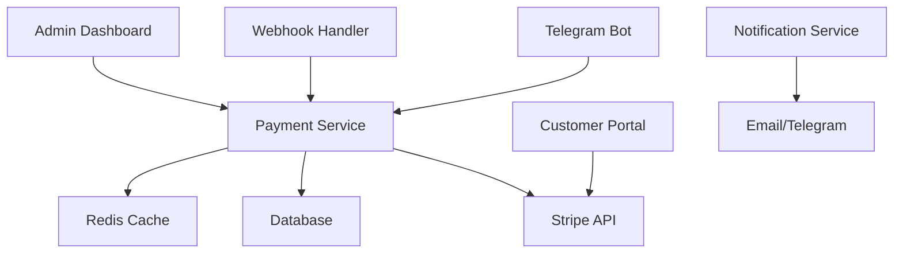

# Stripe Payment Integration Architecture for Reddit Bot System

## Executive Summary

This document outlines the comprehensive Stripe payment integration for the Reddit bot system, designed to handle $150/week retainer subscriptions with enterprise-grade security, compliance, and user experience features.

## Table of Contents

1. [Research Summary: Stripe Best Practices 2025](#research-summary)
2. [Payment Architecture Design](#payment-architecture)
3. [Database Schema Extensions](#database-schema)
4. [API Endpoints & Implementation](#api-implementation)
5. [Telegram Bot Integration](#telegram-integration)
6. [Security & Compliance](#security-compliance)
7. [Testing Strategy](#testing-strategy)
8. [Implementation Plan](#implementation-plan)

## Research Summary: Stripe Best Practices 2025

### Key Findings

**Subscription Management Evolution:**
- Stripe's new Usage-Based Billing for flexible pricing
- Enhanced Customer Portal with self-service capabilities
- Improved dunning management with ML-powered recovery
- Advanced webhook reliability with automatic retries

**Security Enhancements:**
- SCA (Strong Customer Authentication) compliance mandatory in EU
- Enhanced fraud detection with Stripe Radar ML
- PCI DSS Level 1 compliance maintained through Stripe Elements
- New 3D Secure 2.0 implementation for reduced friction

**Payment Methods Expansion:**
- SEPA Direct Debit, ACH, and international payment methods
- Buy Now, Pay Later (BNPL) options integration
- Cryptocurrency payment support (where legal)
- Mobile wallet optimizations (Apple Pay, Google Pay)

**Developer Experience:**
- Improved webhooks with guaranteed delivery
- Enhanced testing tools with realistic scenarios
- Better error handling and retry mechanisms
- Advanced analytics and reporting APIs

## Payment Architecture Design

### Core Components



### Subscription Tiers & Pricing Model

```python
# Subscription configuration
SUBSCRIPTION_TIERS = {
    "basic": {
        "name": "Basic Bot Service",
        "price": 15000,  # $150.00 in cents
        "currency": "usd",
        "interval": "week",
        "features": [
            "Basic Reddit automation",
            "Standard response time",
            "Email support"
        ],
        "trial_days": 7
    },
    "premium": {
        "name": "Premium Bot Service",
        "price": 25000,  # $250.00 in cents
        "currency": "usd", 
        "interval": "week",
        "features": [
            "Advanced Reddit automation",
            "Priority response time",
            "Advanced ML personality adaptation",
            "Priority support",
            "Custom integrations"
        ],
        "trial_days": 7
    },
    "enterprise": {
        "name": "Enterprise Bot Service",
        "price": 50000,  # $500.00 in cents
        "currency": "usd",
        "interval": "week", 
        "features": [
            "Full Reddit automation suite",
            "Real-time response",
            "Custom ML models",
            "Dedicated support",
            "White-label options",
            "API access"
        ],
        "trial_days": 14
    }
}
```

### Payment Flow Architecture

**Subscription Creation Flow:**
1. User initiates subscription via Telegram
2. System creates Stripe Customer
3. Payment method collection via Stripe Elements
4. Subscription creation with trial period
5. Webhook confirmation and service activation
6. Welcome message and onboarding

**Payment Failure Recovery:**
1. Webhook receives `invoice.payment_failed`
2. Smart retry strategy (3 attempts over 7 days)
3. Customer notification via Telegram + Email
4. Offer payment method update
5. Service graceful degradation
6. Final cancellation after retry period

## Database Schema Extensions

### New Payment Tables

```sql
-- Customers table for Stripe integration
CREATE TABLE stripe_customers (
    id UUID PRIMARY KEY DEFAULT gen_random_uuid(),
    created_at TIMESTAMP WITH TIME ZONE DEFAULT NOW(),
    updated_at TIMESTAMP WITH TIME ZONE DEFAULT NOW(),
    deleted_at TIMESTAMP WITH TIME ZONE,
    is_deleted BOOLEAN DEFAULT FALSE,
    
    -- User relationship
    user_id UUID NOT NULL REFERENCES users(id) ON DELETE CASCADE,
    
    -- Stripe data
    stripe_customer_id VARCHAR(255) UNIQUE NOT NULL,
    email VARCHAR(255),
    name VARCHAR(255),
    phone VARCHAR(50),
    
    -- Customer details
    default_payment_method_id VARCHAR(255),
    invoice_prefix VARCHAR(20),
    currency CHAR(3) DEFAULT 'USD',
    timezone VARCHAR(50),
    
    -- Address information
    address_line1 VARCHAR(255),
    address_line2 VARCHAR(255),
    address_city VARCHAR(100),
    address_state VARCHAR(100),
    address_postal_code VARCHAR(20),
    address_country CHAR(2),
    
    -- Customer portal
    portal_configuration_id VARCHAR(255),
    
    -- Metadata
    metadata JSONB DEFAULT '{}',
    
    -- Indexes
    CONSTRAINT idx_customer_user_unique UNIQUE (user_id),
    INDEX idx_customer_stripe_id (stripe_customer_id),
    INDEX idx_customer_email (email)
);

-- Subscriptions table
CREATE TABLE stripe_subscriptions (
    id UUID PRIMARY KEY DEFAULT gen_random_uuid(),
    created_at TIMESTAMP WITH TIME ZONE DEFAULT NOW(),
    updated_at TIMESTAMP WITH TIME ZONE DEFAULT NOW(),
    deleted_at TIMESTAMP WITH TIME ZONE,
    is_deleted BOOLEAN DEFAULT FALSE,
    
    -- Relationships
    user_id UUID NOT NULL REFERENCES users(id) ON DELETE CASCADE,
    customer_id UUID NOT NULL REFERENCES stripe_customers(id) ON DELETE CASCADE,
    
    -- Stripe data
    stripe_subscription_id VARCHAR(255) UNIQUE NOT NULL,
    stripe_product_id VARCHAR(255) NOT NULL,
    stripe_price_id VARCHAR(255) NOT NULL,
    
    -- Subscription details
    status VARCHAR(50) NOT NULL, -- active, trialing, past_due, canceled, unpaid
    current_period_start TIMESTAMP WITH TIME ZONE NOT NULL,
    current_period_end TIMESTAMP WITH TIME ZONE NOT NULL,
    trial_start TIMESTAMP WITH TIME ZONE,
    trial_end TIMESTAMP WITH TIME ZONE,
    cancel_at_period_end BOOLEAN DEFAULT FALSE,
    canceled_at TIMESTAMP WITH TIME ZONE,
    
    -- Pricing
    currency CHAR(3) DEFAULT 'USD',
    interval_type VARCHAR(20) NOT NULL, -- day, week, month, year
    interval_count INTEGER DEFAULT 1,
    unit_amount INTEGER NOT NULL, -- in cents
    
    -- Service configuration
    tier_name VARCHAR(50) NOT NULL,
    features JSONB DEFAULT '[]',
    usage_limits JSONB DEFAULT '{}',
    
    -- Billing
    collection_method VARCHAR(20) DEFAULT 'charge_automatically',
    days_until_due INTEGER,
    
    -- Metadata
    metadata JSONB DEFAULT '{}',
    
    -- Constraints
    CHECK (status IN ('active', 'trialing', 'past_due', 'canceled', 'unpaid', 'incomplete', 'incomplete_expired')),
    CHECK (interval_type IN ('day', 'week', 'month', 'year')),
    CHECK (unit_amount > 0),
    
    -- Indexes
    INDEX idx_subscription_user (user_id),
    INDEX idx_subscription_status (status),
    INDEX idx_subscription_period (current_period_start, current_period_end),
    INDEX idx_subscription_stripe_id (stripe_subscription_id)
);

-- Payment methods table
CREATE TABLE stripe_payment_methods (
    id UUID PRIMARY KEY DEFAULT gen_random_uuid(),
    created_at TIMESTAMP WITH TIME ZONE DEFAULT NOW(),
    updated_at TIMESTAMP WITH TIME ZONE DEFAULT NOW(),
    
    -- Relationships
    user_id UUID NOT NULL REFERENCES users(id) ON DELETE CASCADE,
    customer_id UUID NOT NULL REFERENCES stripe_customers(id) ON DELETE CASCADE,
    
    -- Stripe data
    stripe_payment_method_id VARCHAR(255) UNIQUE NOT NULL,
    type VARCHAR(50) NOT NULL, -- card, bank_account, etc.
    
    -- Card details (if applicable)
    card_brand VARCHAR(20),
    card_last4 VARCHAR(4),
    card_exp_month INTEGER,
    card_exp_year INTEGER,
    card_country VARCHAR(2),
    
    -- Bank account details (if applicable)
    bank_account_bank_name VARCHAR(255),
    bank_account_last4 VARCHAR(4),
    bank_account_account_type VARCHAR(20),
    
    -- Status
    is_default BOOLEAN DEFAULT FALSE,
    is_active BOOLEAN DEFAULT TRUE,
    
    -- Metadata
    metadata JSONB DEFAULT '{}',
    
    -- Constraints
    CHECK (type IN ('card', 'us_bank_account', 'sepa_debit', 'ach_debit')),
    
    -- Indexes
    INDEX idx_payment_method_user (user_id),
    INDEX idx_payment_method_customer (customer_id),
    INDEX idx_payment_method_default (customer_id, is_default) WHERE is_default = TRUE
);

-- Invoices table
CREATE TABLE stripe_invoices (
    id UUID PRIMARY KEY DEFAULT gen_random_uuid(),
    created_at TIMESTAMP WITH TIME ZONE DEFAULT NOW(),
    updated_at TIMESTAMP WITH TIME ZONE DEFAULT NOW(),
    
    -- Relationships  
    user_id UUID NOT NULL REFERENCES users(id) ON DELETE CASCADE,
    customer_id UUID NOT NULL REFERENCES stripe_customers(id) ON DELETE CASCADE,
    subscription_id UUID REFERENCES stripe_subscriptions(id) ON DELETE SET NULL,
    
    -- Stripe data
    stripe_invoice_id VARCHAR(255) UNIQUE NOT NULL,
    stripe_charge_id VARCHAR(255),
    stripe_payment_intent_id VARCHAR(255),
    
    -- Invoice details
    invoice_number VARCHAR(100),
    status VARCHAR(50) NOT NULL,
    currency CHAR(3) DEFAULT 'USD',
    amount_total INTEGER NOT NULL,
    amount_paid INTEGER DEFAULT 0,
    amount_due INTEGER DEFAULT 0,
    subtotal INTEGER NOT NULL,
    tax_amount INTEGER DEFAULT 0,
    
    -- Dates
    period_start TIMESTAMP WITH TIME ZONE,
    period_end TIMESTAMP WITH TIME ZONE,
    due_date TIMESTAMP WITH TIME ZONE,
    finalized_at TIMESTAMP WITH TIME ZONE,
    paid_at TIMESTAMP WITH TIME ZONE,
    
    -- URLs
    invoice_pdf_url TEXT,
    hosted_invoice_url TEXT,
    
    -- Payment attempt tracking
    attempt_count INTEGER DEFAULT 0,
    next_payment_attempt TIMESTAMP WITH TIME ZONE,
    
    -- Metadata
    metadata JSONB DEFAULT '{}',
    
    -- Constraints
    CHECK (status IN ('draft', 'open', 'paid', 'void', 'uncollectible')),
    CHECK (amount_total >= 0),
    CHECK (amount_paid >= 0),
    CHECK (amount_due >= 0),
    
    -- Indexes
    INDEX idx_invoice_user (user_id),
    INDEX idx_invoice_status (status),
    INDEX idx_invoice_due_date (due_date),
    INDEX idx_invoice_period (period_start, period_end)
);

-- Payment attempts and failures table
CREATE TABLE payment_attempts (
    id UUID PRIMARY KEY DEFAULT gen_random_uuid(),
    created_at TIMESTAMP WITH TIME ZONE DEFAULT NOW(),
    
    -- Relationships
    user_id UUID NOT NULL REFERENCES users(id) ON DELETE CASCADE,
    subscription_id UUID REFERENCES stripe_subscriptions(id) ON DELETE CASCADE,
    invoice_id UUID REFERENCES stripe_invoices(id) ON DELETE CASCADE,
    
    -- Attempt details
    attempt_number INTEGER NOT NULL,
    status VARCHAR(50) NOT NULL, -- succeeded, failed, pending, requires_action
    failure_code VARCHAR(100),
    failure_message TEXT,
    
    -- Payment method used
    payment_method_type VARCHAR(50),
    payment_method_last4 VARCHAR(4),
    
    -- Amounts
    amount_attempted INTEGER NOT NULL,
    currency CHAR(3) DEFAULT 'USD',
    
    -- Stripe IDs
    stripe_payment_intent_id VARCHAR(255),
    stripe_charge_id VARCHAR(255),
    
    -- Next attempt scheduling
    next_attempt_at TIMESTAMP WITH TIME ZONE,
    
    -- Metadata
    metadata JSONB DEFAULT '{}',
    
    -- Constraints
    CHECK (status IN ('succeeded', 'failed', 'pending', 'requires_action', 'canceled')),
    CHECK (attempt_number > 0),
    
    -- Indexes
    INDEX idx_attempt_user_status (user_id, status),
    INDEX idx_attempt_subscription (subscription_id),
    INDEX idx_attempt_next (next_attempt_at) WHERE next_attempt_at IS NOT NULL
);

-- Webhook events table for reliability
CREATE TABLE stripe_webhook_events (
    id UUID PRIMARY KEY DEFAULT gen_random_uuid(),
    created_at TIMESTAMP WITH TIME ZONE DEFAULT NOW(),
    processed_at TIMESTAMP WITH TIME ZONE,
    
    -- Stripe webhook data
    stripe_event_id VARCHAR(255) UNIQUE NOT NULL,
    event_type VARCHAR(100) NOT NULL,
    api_version VARCHAR(20),
    
    -- Processing status
    status VARCHAR(50) DEFAULT 'pending',
    retry_count INTEGER DEFAULT 0,
    error_message TEXT,
    
    -- Event data
    data JSONB NOT NULL,
    
    -- Constraints
    CHECK (status IN ('pending', 'processing', 'completed', 'failed', 'skipped')),
    
    -- Indexes
    INDEX idx_webhook_event_type (event_type),
    INDEX idx_webhook_status (status),
    INDEX idx_webhook_created (created_at)
);
```

## API Implementation

### Core Payment Service

```python
# app/services/stripe_service.py

import stripe
import logging
from typing import Dict, Optional, List, Any
from datetime import datetime, timedelta
from decimal import Decimal

from app.core.config import settings
from app.models.user import User
from app.models.stripe_models import StripeCustomer, StripeSubscription, StripeInvoice
from app.database.repositories import StripeRepository
from app.core.redis import get_redis_client
from app.services.notification_service import NotificationService

logger = logging.getLogger(__name__)

# Configure Stripe
stripe.api_key = settings.stripe.secret_key
stripe.api_version = "2023-10-16"


class StripePaymentService:
    """
    Comprehensive Stripe payment service with enterprise features.
    
    Handles subscriptions, payments, webhooks, and customer management
    with full PCI compliance and security best practices.
    """
    
    def __init__(self):
        self.repository = StripeRepository()
        self.redis = get_redis_client()
        self.notification_service = NotificationService()
        
    async def create_customer(
        self,
        user: User,
        email: str,
        name: Optional[str] = None,
        phone: Optional[str] = None,
        address: Optional[Dict[str, str]] = None
    ) -> StripeCustomer:
        """
        Create a new Stripe customer and local record.
        
        Args:
            user: User model instance
            email: Customer email address
            name: Customer full name
            phone: Customer phone number
            address: Customer address dict
            
        Returns:
            StripeCustomer: Created customer record
            
        Raises:
            StripeError: If customer creation fails
        """
        try:
            # Check if customer already exists
            existing_customer = await self.repository.get_customer_by_user_id(user.id)
            if existing_customer:
                logger.warning(f"Customer already exists for user {user.id}")
                return existing_customer
                
            # Create Stripe customer
            stripe_customer_data = {
                "email": email,
                "metadata": {
                    "user_id": str(user.id),
                    "telegram_id": str(user.telegram_id),
                    "telegram_username": user.username or "",
                    "created_by": "reddit_bot_system"
                }
            }
            
            if name:
                stripe_customer_data["name"] = name
            if phone:
                stripe_customer_data["phone"] = phone
            if address:
                stripe_customer_data["address"] = address
                
            stripe_customer = stripe.Customer.create(**stripe_customer_data)
            
            # Create local customer record
            customer_data = {
                "user_id": user.id,
                "stripe_customer_id": stripe_customer.id,
                "email": email,
                "name": name,
                "phone": phone,
                "metadata": {"stripe_data": dict(stripe_customer)},
            }
            
            if address:
                customer_data.update({
                    "address_line1": address.get("line1"),
                    "address_line2": address.get("line2"),
                    "address_city": address.get("city"),
                    "address_state": address.get("state"),
                    "address_postal_code": address.get("postal_code"),
                    "address_country": address.get("country"),
                })
                
            customer = await self.repository.create_customer(**customer_data)
            
            # Cache customer for quick access
            await self._cache_customer(customer)
            
            logger.info(f"Created Stripe customer {stripe_customer.id} for user {user.id}")
            return customer
            
        except stripe.StripeError as e:
            logger.error(f"Failed to create Stripe customer for user {user.id}: {e}")
            raise
        except Exception as e:
            logger.error(f"Unexpected error creating customer for user {user.id}: {e}")
            raise
    
    async def create_subscription(
        self,
        user: User,
        tier: str,
        payment_method_id: str,
        trial_days: Optional[int] = None,
        coupon_code: Optional[str] = None
    ) -> StripeSubscription:
        """
        Create a new subscription with trial period and proper setup.
        
        Args:
            user: User model instance
            tier: Subscription tier (basic, premium, enterprise)
            payment_method_id: Stripe payment method ID
            trial_days: Number of trial days (overrides tier default)
            coupon_code: Optional coupon code for discount
            
        Returns:
            StripeSubscription: Created subscription record
        """
        try:
            # Get or create customer
            customer = await self.repository.get_customer_by_user_id(user.id)
            if not customer:
                raise ValueError(f"No customer found for user {user.id}")
                
            # Get subscription tier configuration
            tier_config = SUBSCRIPTION_TIERS.get(tier)
            if not tier_config:
                raise ValueError(f"Invalid subscription tier: {tier}")
                
            # Attach payment method to customer
            await self._attach_payment_method(customer.stripe_customer_id, payment_method_id)
            
            # Set as default payment method
            stripe.Customer.modify(
                customer.stripe_customer_id,
                invoice_settings={
                    "default_payment_method": payment_method_id
                }
            )
            
            # Prepare subscription data
            subscription_data = {
                "customer": customer.stripe_customer_id,
                "items": [{
                    "price_data": {
                        "currency": tier_config["currency"],
                        "unit_amount": tier_config["price"],
                        "recurring": {
                            "interval": tier_config["interval"]
                        },
                        "product_data": {
                            "name": tier_config["name"],
                            "metadata": {
                                "tier": tier,
                                "features": ",".join(tier_config["features"])
                            }
                        }
                    }
                }],
                "payment_behavior": "default_incomplete",
                "payment_settings": {
                    "save_default_payment_method": "on_subscription"
                },
                "expand": ["latest_invoice.payment_intent"],
                "metadata": {
                    "user_id": str(user.id),
                    "tier": tier,
                    "telegram_id": str(user.telegram_id),
                    "created_by": "reddit_bot_system"
                }
            }
            
            # Add trial period
            trial_days = trial_days or tier_config.get("trial_days", 0)
            if trial_days > 0:
                subscription_data["trial_period_days"] = trial_days
                
            # Add coupon if provided
            if coupon_code:
                subscription_data["coupon"] = coupon_code
                
            # Create Stripe subscription
            stripe_subscription = stripe.Subscription.create(**subscription_data)
            
            # Create local subscription record
            subscription_record = await self._create_local_subscription(
                user, customer, stripe_subscription, tier, tier_config
            )
            
            # Handle payment intent confirmation if needed
            if stripe_subscription.status == "incomplete":
                await self._handle_incomplete_subscription(subscription_record, stripe_subscription)
                
            # Cache subscription for quick access
            await self._cache_subscription(subscription_record)
            
            # Send confirmation notification
            await self.notification_service.send_subscription_created_notification(
                user, subscription_record
            )
            
            logger.info(f"Created subscription {stripe_subscription.id} for user {user.id}")
            return subscription_record
            
        except stripe.StripeError as e:
            logger.error(f"Failed to create subscription for user {user.id}: {e}")
            raise
        except Exception as e:
            logger.error(f"Unexpected error creating subscription for user {user.id}: {e}")
            raise
    
    async def handle_payment_failure(
        self,
        subscription_id: str,
        invoice_id: str,
        failure_reason: str
    ) -> None:
        """
        Handle payment failure with smart retry and customer communication.
        
        Implements dunning management with grace periods and multiple
        notification channels.
        """
        try:
            subscription = await self.repository.get_subscription_by_stripe_id(subscription_id)
            if not subscription:
                logger.error(f"Subscription not found: {subscription_id}")
                return
                
            user = await self.repository.get_user_by_id(subscription.user_id)
            
            # Record payment attempt
            await self.repository.create_payment_attempt(
                user_id=user.id,
                subscription_id=subscription.id,
                status="failed",
                failure_message=failure_reason,
                attempt_number=await self._get_next_attempt_number(subscription.id)
            )
            
            # Implement smart retry strategy
            retry_schedule = await self._calculate_retry_schedule(subscription.id)
            
            if retry_schedule["should_retry"]:
                # Schedule next retry
                await self._schedule_payment_retry(subscription, retry_schedule["next_attempt"])
                
                # Send failure notification with retry info
                await self.notification_service.send_payment_failure_notification(
                    user, subscription, retry_schedule
                )
                
            else:
                # Final failure - begin service degradation
                await self._begin_service_degradation(subscription)
                
                # Send final notice
                await self.notification_service.send_final_payment_failure_notification(
                    user, subscription
                )
                
            logger.info(f"Handled payment failure for subscription {subscription_id}")
            
        except Exception as e:
            logger.error(f"Error handling payment failure for {subscription_id}: {e}")
            
    async def create_customer_portal_session(
        self,
        user: User,
        return_url: str
    ) -> Dict[str, str]:
        """
        Create Stripe customer portal session for self-service billing.
        
        Args:
            user: User model instance
            return_url: URL to return to after portal session
            
        Returns:
            Dict containing portal session URL
        """
        try:
            customer = await self.repository.get_customer_by_user_id(user.id)
            if not customer:
                raise ValueError(f"No customer found for user {user.id}")
                
            portal_session = stripe.billing_portal.Session.create(
                customer=customer.stripe_customer_id,
                return_url=return_url,
                configuration=settings.stripe.portal_configuration_id
            )
            
            return {"url": portal_session.url}
            
        except stripe.StripeError as e:
            logger.error(f"Failed to create portal session for user {user.id}: {e}")
            raise
    
    async def process_webhook_event(self, event_data: Dict[str, Any]) -> None:
        """
        Process incoming Stripe webhook events with idempotency and reliability.
        
        Args:
            event_data: Stripe webhook event data
        """
        try:
            # Store webhook event for processing
            webhook_event = await self.repository.create_webhook_event(event_data)
            
            # Process based on event type
            event_type = event_data["type"]
            
            if event_type == "customer.subscription.created":
                await self._handle_subscription_created(event_data["data"]["object"])
            elif event_type == "customer.subscription.updated":
                await self._handle_subscription_updated(event_data["data"]["object"])
            elif event_type == "customer.subscription.deleted":
                await self._handle_subscription_deleted(event_data["data"]["object"])
            elif event_type == "invoice.payment_succeeded":
                await self._handle_payment_succeeded(event_data["data"]["object"])
            elif event_type == "invoice.payment_failed":
                await self._handle_payment_failed(event_data["data"]["object"])
            elif event_type == "customer.created":
                await self._handle_customer_created(event_data["data"]["object"])
            elif event_type == "payment_method.attached":
                await self._handle_payment_method_attached(event_data["data"]["object"])
            else:
                logger.info(f"Unhandled webhook event type: {event_type}")
                
            # Mark webhook as processed
            await self.repository.mark_webhook_processed(webhook_event.id)
            
        except Exception as e:
            logger.error(f"Error processing webhook event: {e}")
            await self.repository.mark_webhook_failed(
                webhook_event.id, 
                str(e)
            )
            raise
    
    # Private helper methods
    
    async def _attach_payment_method(self, customer_id: str, payment_method_id: str) -> None:
        """Attach payment method to customer."""
        stripe.PaymentMethod.attach(
            payment_method_id,
            customer=customer_id
        )
    
    async def _create_local_subscription(
        self,
        user: User,
        customer: StripeCustomer,
        stripe_subscription: Any,
        tier: str,
        tier_config: Dict[str, Any]
    ) -> StripeSubscription:
        """Create local subscription record from Stripe subscription."""
        subscription_data = {
            "user_id": user.id,
            "customer_id": customer.id,
            "stripe_subscription_id": stripe_subscription.id,
            "status": stripe_subscription.status,
            "current_period_start": datetime.fromtimestamp(
                stripe_subscription.current_period_start
            ),
            "current_period_end": datetime.fromtimestamp(
                stripe_subscription.current_period_end
            ),
            "currency": tier_config["currency"],
            "interval_type": tier_config["interval"],
            "unit_amount": tier_config["price"],
            "tier_name": tier,
            "features": tier_config["features"],
            "metadata": {"stripe_data": dict(stripe_subscription)}
        }
        
        if stripe_subscription.trial_start:
            subscription_data["trial_start"] = datetime.fromtimestamp(
                stripe_subscription.trial_start
            )
        if stripe_subscription.trial_end:
            subscription_data["trial_end"] = datetime.fromtimestamp(
                stripe_subscription.trial_end
            )
            
        return await self.repository.create_subscription(**subscription_data)
    
    async def _cache_customer(self, customer: StripeCustomer) -> None:
        """Cache customer data in Redis for quick access."""
        cache_key = f"stripe:customer:{customer.user_id}"
        await self.redis.setex(
            cache_key,
            3600,  # 1 hour TTL
            customer.json()
        )
    
    async def _cache_subscription(self, subscription: StripeSubscription) -> None:
        """Cache subscription data in Redis for quick access."""
        cache_key = f"stripe:subscription:{subscription.user_id}"
        await self.redis.setex(
            cache_key,
            3600,  # 1 hour TTL
            subscription.json()
        )
    
    async def _get_next_attempt_number(self, subscription_id: str) -> int:
        """Get next payment attempt number for subscription."""
        attempts = await self.repository.get_payment_attempts_by_subscription(
            subscription_id
        )
        return len(attempts) + 1
    
    async def _calculate_retry_schedule(
        self, 
        subscription_id: str
    ) -> Dict[str, Any]:
        """
        Calculate smart retry schedule based on failure history.
        
        Returns dict with retry decision and next attempt time.
        """
        attempts = await self.repository.get_payment_attempts_by_subscription(
            subscription_id
        )
        
        failed_attempts = [a for a in attempts if a.status == "failed"]
        attempt_count = len(failed_attempts)
        
        # Maximum 3 retry attempts over 7 days
        if attempt_count >= 3:
            return {"should_retry": False}
            
        # Progressive retry delays: 1 day, 3 days, 7 days
        retry_delays = [1, 3, 7]
        next_delay = retry_delays[attempt_count]
        next_attempt = datetime.utcnow() + timedelta(days=next_delay)
        
        return {
            "should_retry": True,
            "next_attempt": next_attempt,
            "attempt_count": attempt_count + 1,
            "total_attempts_allowed": 3
        }
    
    async def _schedule_payment_retry(
        self,
        subscription: StripeSubscription,
        next_attempt: datetime
    ) -> None:
        """Schedule payment retry using Celery task."""
        from app.tasks.payment_tasks import retry_failed_payment
        
        retry_failed_payment.apply_async(
            args=[subscription.stripe_subscription_id],
            eta=next_attempt
        )
    
    async def _begin_service_degradation(
        self,
        subscription: StripeSubscription
    ) -> None:
        """Begin gradual service degradation for unpaid subscription."""
        # Update subscription status
        await self.repository.update_subscription_status(
            subscription.id, 
            "past_due"
        )
        
        # Reduce service levels gradually
        user = await self.repository.get_user_by_id(subscription.user_id)
        
        # Disable premium features
        await self.repository.update_user_preferences(
            user.id,
            {"service_level": "limited", "premium_features_disabled": True}
        )
        
        # Schedule final cancellation in 7 days if no payment
        from app.tasks.payment_tasks import final_subscription_cancellation
        
        final_cancellation_date = datetime.utcnow() + timedelta(days=7)
        final_subscription_cancellation.apply_async(
            args=[subscription.stripe_subscription_id],
            eta=final_cancellation_date
        )
    
    # Webhook handler methods
    
    async def _handle_subscription_created(self, subscription_data: Dict[str, Any]) -> None:
        """Handle subscription.created webhook."""
        # Subscription already created in create_subscription method
        logger.info(f"Subscription created webhook received: {subscription_data['id']}")
    
    async def _handle_subscription_updated(self, subscription_data: Dict[str, Any]) -> None:
        """Handle subscription.updated webhook."""
        subscription = await self.repository.get_subscription_by_stripe_id(
            subscription_data["id"]
        )
        if subscription:
            await self.repository.update_subscription_from_stripe_data(
                subscription.id, subscription_data
            )
    
    async def _handle_payment_succeeded(self, invoice_data: Dict[str, Any]) -> None:
        """Handle invoice.payment_succeeded webhook."""
        subscription_id = invoice_data.get("subscription")
        if subscription_id:
            subscription = await self.repository.get_subscription_by_stripe_id(
                subscription_id
            )
            if subscription:
                # Restore full service
                user = await self.repository.get_user_by_id(subscription.user_id)
                await self.repository.update_user_preferences(
                    user.id,
                    {"service_level": "full", "premium_features_disabled": False}
                )
                
                # Send success notification
                await self.notification_service.send_payment_success_notification(
                    user, subscription
                )
    
    async def _handle_payment_failed(self, invoice_data: Dict[str, Any]) -> None:
        """Handle invoice.payment_failed webhook."""
        subscription_id = invoice_data.get("subscription")
        if subscription_id:
            await self.handle_payment_failure(
                subscription_id,
                invoice_data["id"],
                invoice_data.get("failure_reason", "Unknown failure")
            )
```

### API Endpoints

```python
# app/api/v1/payments.py

from fastapi import APIRouter, Depends, HTTPException, status, Request
from fastapi.security import HTTPBearer
from typing import Dict, List, Optional
import stripe

from app.services.stripe_service import StripePaymentService
from app.services.auth_service import get_current_user
from app.models.user import User
from app.schemas.payment_schemas import (
    CreateSubscriptionRequest,
    CreateCustomerRequest,
    PaymentMethodRequest,
    CustomerPortalRequest,
    WebhookEventSchema
)
from app.core.config import settings

router = APIRouter(prefix="/payments", tags=["payments"])
security = HTTPBearer()
stripe_service = StripePaymentService()


@router.post("/customers")
async def create_customer(
    request: CreateCustomerRequest,
    current_user: User = Depends(get_current_user)
) -> Dict[str, str]:
    """
    Create a new Stripe customer for the current user.
    
    This endpoint creates both a Stripe customer and local database record.
    Required before creating subscriptions or processing payments.
    """
    try:
        customer = await stripe_service.create_customer(
            user=current_user,
            email=request.email,
            name=request.name,
            phone=request.phone,
            address=request.address
        )
        
        return {
            "customer_id": customer.stripe_customer_id,
            "message": "Customer created successfully"
        }
        
    except stripe.StripeError as e:
        raise HTTPException(
            status_code=status.HTTP_400_BAD_REQUEST,
            detail=f"Failed to create customer: {str(e)}"
        )


@router.post("/subscriptions")
async def create_subscription(
    request: CreateSubscriptionRequest,
    current_user: User = Depends(get_current_user)
) -> Dict[str, Any]:
    """
    Create a new subscription for the current user.
    
    Supports trial periods, coupon codes, and multiple payment methods.
    Returns subscription details and payment status.
    """
    try:
        subscription = await stripe_service.create_subscription(
            user=current_user,
            tier=request.tier,
            payment_method_id=request.payment_method_id,
            trial_days=request.trial_days,
            coupon_code=request.coupon_code
        )
        
        return {
            "subscription_id": subscription.stripe_subscription_id,
            "status": subscription.status,
            "trial_end": subscription.trial_end,
            "current_period_end": subscription.current_period_end,
            "features": subscription.features,
            "message": "Subscription created successfully"
        }
        
    except ValueError as e:
        raise HTTPException(
            status_code=status.HTTP_400_BAD_REQUEST,
            detail=str(e)
        )
    except stripe.StripeError as e:
        raise HTTPException(
            status_code=status.HTTP_400_BAD_REQUEST,
            detail=f"Failed to create subscription: {str(e)}"
        )


@router.get("/subscriptions/current")
async def get_current_subscription(
    current_user: User = Depends(get_current_user)
) -> Dict[str, Any]:
    """Get the current user's active subscription details."""
    try:
        subscription = await stripe_service.repository.get_active_subscription_by_user_id(
            current_user.id
        )
        
        if not subscription:
            raise HTTPException(
                status_code=status.HTTP_404_NOT_FOUND,
                detail="No active subscription found"
            )
        
        return {
            "subscription_id": subscription.stripe_subscription_id,
            "tier": subscription.tier_name,
            "status": subscription.status,
            "current_period_start": subscription.current_period_start,
            "current_period_end": subscription.current_period_end,
            "trial_end": subscription.trial_end,
            "features": subscription.features,
            "amount": subscription.unit_amount,
            "currency": subscription.currency,
            "interval": subscription.interval_type
        }
        
    except Exception as e:
        raise HTTPException(
            status_code=status.HTTP_500_INTERNAL_SERVER_ERROR,
            detail=f"Failed to retrieve subscription: {str(e)}"
        )


@router.post("/portal")
async def create_customer_portal_session(
    request: CustomerPortalRequest,
    current_user: User = Depends(get_current_user)
) -> Dict[str, str]:
    """
    Create a Stripe customer portal session for self-service billing.
    
    Returns a secure URL where customers can manage their billing,
    update payment methods, download invoices, and cancel subscriptions.
    """
    try:
        portal_session = await stripe_service.create_customer_portal_session(
            user=current_user,
            return_url=request.return_url
        )
        
        return portal_session
        
    except ValueError as e:
        raise HTTPException(
            status_code=status.HTTP_400_BAD_REQUEST,
            detail=str(e)
        )
    except stripe.StripeError as e:
        raise HTTPException(
            status_code=status.HTTP_400_BAD_REQUEST,
            detail=f"Failed to create portal session: {str(e)}"
        )


@router.get("/invoices")
async def get_user_invoices(
    limit: int = 10,
    current_user: User = Depends(get_current_user)
) -> List[Dict[str, Any]]:
    """Get the current user's invoice history."""
    try:
        invoices = await stripe_service.repository.get_invoices_by_user_id(
            current_user.id, limit=limit
        )
        
        return [
            {
                "invoice_id": invoice.stripe_invoice_id,
                "invoice_number": invoice.invoice_number,
                "status": invoice.status,
                "amount_total": invoice.amount_total,
                "amount_paid": invoice.amount_paid,
                "currency": invoice.currency,
                "period_start": invoice.period_start,
                "period_end": invoice.period_end,
                "due_date": invoice.due_date,
                "paid_at": invoice.paid_at,
                "invoice_pdf_url": invoice.invoice_pdf_url,
                "hosted_invoice_url": invoice.hosted_invoice_url
            }
            for invoice in invoices
        ]
        
    except Exception as e:
        raise HTTPException(
            status_code=status.HTTP_500_INTERNAL_SERVER_ERROR,
            detail=f"Failed to retrieve invoices: {str(e)}"
        )


@router.get("/payment-methods")
async def get_payment_methods(
    current_user: User = Depends(get_current_user)
) -> List[Dict[str, Any]]:
    """Get the current user's saved payment methods."""
    try:
        payment_methods = await stripe_service.repository.get_payment_methods_by_user_id(
            current_user.id
        )
        
        return [
            {
                "id": pm.stripe_payment_method_id,
                "type": pm.type,
                "card_brand": pm.card_brand,
                "card_last4": pm.card_last4,
                "card_exp_month": pm.card_exp_month,
                "card_exp_year": pm.card_exp_year,
                "is_default": pm.is_default,
                "created_at": pm.created_at
            }
            for pm in payment_methods
            if pm.is_active
        ]
        
    except Exception as e:
        raise HTTPException(
            status_code=status.HTTP_500_INTERNAL_SERVER_ERROR,
            detail=f"Failed to retrieve payment methods: {str(e)}"
        )


@router.post("/webhooks/stripe")
async def handle_stripe_webhook(request: Request) -> Dict[str, str]:
    """
    Handle incoming Stripe webhook events.
    
    Validates webhook signature and processes events for subscription
    updates, payment confirmations, and failure notifications.
    """
    try:
        payload = await request.body()
        sig_header = request.headers.get("stripe-signature")
        
        # Verify webhook signature
        event = stripe.Webhook.construct_event(
            payload, sig_header, settings.stripe.webhook_secret
        )
        
        # Process the webhook event
        await stripe_service.process_webhook_event(event)
        
        return {"status": "success"}
        
    except ValueError as e:
        # Invalid payload
        raise HTTPException(
            status_code=status.HTTP_400_BAD_REQUEST,
            detail="Invalid payload"
        )
    except stripe.SignatureVerificationError as e:
        # Invalid signature
        raise HTTPException(
            status_code=status.HTTP_400_BAD_REQUEST,
            detail="Invalid signature"
        )
    except Exception as e:
        # Other errors
        raise HTTPException(
            status_code=status.HTTP_500_INTERNAL_SERVER_ERROR,
            detail=f"Webhook processing failed: {str(e)}"
        )


@router.get("/subscription-tiers")
async def get_subscription_tiers() -> Dict[str, Any]:
    """Get available subscription tiers with pricing and features."""
    return {
        "tiers": SUBSCRIPTION_TIERS,
        "currency_symbol": "$",
        "tax_info": "Taxes calculated at checkout based on location"
    }
```

## Telegram Bot Integration

### Payment Commands and Flow

```python
# app/telegram/handlers/payment_handlers.py

import logging
from aiogram import Router, F
from aiogram.types import Message, CallbackQuery, InlineKeyboardMarkup, InlineKeyboardButton
from aiogram.fsm.context import FSMContext
from aiogram.fsm.state import State, StatesGroup
from typing import Dict, Any

from app.services.stripe_service import StripePaymentService, SUBSCRIPTION_TIERS
from app.services.user_service import UserService
from app.telegram.keyboards.payment_keyboards import (
    get_subscription_tiers_keyboard,
    get_payment_method_keyboard,
    get_subscription_management_keyboard
)
from app.telegram.utils.decorators import authorized_only
from app.core.config import settings

logger = logging.getLogger(__name__)
router = Router()

stripe_service = StripePaymentService()
user_service = UserService()


class PaymentStates(StatesGroup):
    """FSM states for payment flow."""
    selecting_tier = State()
    entering_email = State()
    adding_payment_method = State()
    confirming_subscription = State()
    processing_payment = State()


@router.message(F.text == "/subscribe")
@authorized_only
async def start_subscription_flow(message: Message, state: FSMContext):
    """
    Start the subscription process.
    
    Shows available tiers and begins the subscription flow.
    """
    try:
        # Check if user already has active subscription
        user = await user_service.get_user_by_telegram_id(message.from_user.id)
        existing_subscription = await stripe_service.repository.get_active_subscription_by_user_id(
            user.id
        )
        
        if existing_subscription:
            await message.reply(
                "🔔 You already have an active subscription!\n\n"
                f"**Current Plan:** {existing_subscription.tier_name.title()}\n"
                f"**Status:** {existing_subscription.status.title()}\n"
                f"**Next Billing:** {existing_subscription.current_period_end.strftime('%Y-%m-%d')}\n\n"
                "Use /manage_subscription to make changes.",
                reply_markup=get_subscription_management_keyboard()
            )
            return
        
        # Show subscription tiers
        tiers_text = "💳 **Choose Your Subscription Plan**\n\n"
        
        for tier_key, tier_info in SUBSCRIPTION_TIERS.items():
            price_display = f"${tier_info['price'] / 100:.2f}/{tier_info['interval']}"
            features_list = '\n'.join([f"  ✓ {feature}" for feature in tier_info['features']])
            trial_info = f"  🎁 {tier_info['trial_days']} days free trial"
            
            tiers_text += f"**{tier_info['name']}** - {price_display}\n"
            tiers_text += f"{features_list}\n"
            tiers_text += f"{trial_info}\n\n"
        
        tiers_text += "Select a plan to get started:"
        
        await message.reply(
            tiers_text,
            reply_markup=get_subscription_tiers_keyboard()
        )
        
        await state.set_state(PaymentStates.selecting_tier)
        
    except Exception as e:
        logger.error(f"Error starting subscription flow: {e}")
        await message.reply(
            "❌ Sorry, there was an error starting the subscription process. "
            "Please try again later or contact support."
        )


@router.callback_query(F.data.startswith("select_tier:"))
async def select_subscription_tier(callback: CallbackQuery, state: FSMContext):
    """Handle tier selection."""
    try:
        tier = callback.data.split(":")[1]
        tier_info = SUBSCRIPTION_TIERS.get(tier)
        
        if not tier_info:
            await callback.answer("Invalid tier selected")
            return
        
        # Store selected tier in state
        await state.update_data(selected_tier=tier)
        
        # Ask for email address
        price_display = f"${tier_info['price'] / 100:.2f}/{tier_info['interval']}"
        
        await callback.message.edit_text(
            f"✅ **{tier_info['name']}** selected - {price_display}\n\n"
            f"🎁 You'll get {tier_info['trial_days']} days free trial!\n\n"
            "Please enter your email address for billing notifications:"
        )
        
        await state.set_state(PaymentStates.entering_email)
        await callback.answer()
        
    except Exception as e:
        logger.error(f"Error selecting tier: {e}")
        await callback.answer("Error selecting tier")


@router.message(PaymentStates.entering_email)
async def process_email(message: Message, state: FSMContext):
    """Process email address input."""
    try:
        email = message.text.strip()
        
        # Basic email validation
        if "@" not in email or "." not in email:
            await message.reply("❌ Please enter a valid email address:")
            return
        
        # Store email in state
        await state.update_data(email=email)
        
        # Create or get Stripe customer
        user = await user_service.get_user_by_telegram_id(message.from_user.id)
        
        try:
            customer = await stripe_service.create_customer(
                user=user,
                email=email,
                name=f"{user.first_name} {user.last_name or ''}".strip() or None
            )
        except Exception as customer_error:
            logger.error(f"Error creating customer: {customer_error}")
            await message.reply(
                "❌ There was an error setting up your account. "
                "Please try again or contact support."
            )
            return
        
        # Generate Stripe payment link or setup intent
        state_data = await state.get_data()
        payment_link = await create_payment_setup_link(
            customer.stripe_customer_id,
            state_data["selected_tier"],
            message.from_user.id
        )
        
        await message.reply(
            "💳 **Payment Method Setup**\n\n"
            "Click the secure link below to add your payment method:\n\n"
            f"🔗 [Add Payment Method]({payment_link})\n\n"
            "This will open Stripe's secure payment form. "
            "Your payment information is never stored on our servers.\n\n"
            "*After adding your payment method, return here and use /confirm_subscription*",
            disable_web_page_preview=True
        )
        
        await state.set_state(PaymentStates.adding_payment_method)
        
    except Exception as e:
        logger.error(f"Error processing email: {e}")
        await message.reply("❌ Error processing email. Please try again.")


async def create_payment_setup_link(
    customer_id: str, 
    tier: str, 
    telegram_user_id: int
) -> str:
    """Create a Stripe setup intent link for payment method collection."""
    try:
        import stripe
        
        # Create setup intent for future payments
        setup_intent = stripe.SetupIntent.create(
            customer=customer_id,
            payment_method_types=["card"],
            usage="off_session",
            metadata={
                "telegram_user_id": str(telegram_user_id),
                "selected_tier": tier,
                "source": "telegram_bot"
            }
        )
        
        # Create checkout session for payment method setup
        checkout_session = stripe.checkout.Session.create(
            customer=customer_id,
            mode="setup",
            payment_method_types=["card"],
            success_url=f"{settings.app.base_url}/payment-success?session_id={{CHECKOUT_SESSION_ID}}",
            cancel_url=f"{settings.app.base_url}/payment-cancel",
            metadata={
                "telegram_user_id": str(telegram_user_id),
                "selected_tier": tier,
                "setup_intent_id": setup_intent.id
            }
        )
        
        return checkout_session.url
        
    except Exception as e:
        logger.error(f"Error creating payment setup link: {e}")
        raise


@router.message(F.text == "/confirm_subscription")
async def confirm_subscription(message: Message, state: FSMContext):
    """Confirm subscription creation after payment method setup."""
    try:
        state_data = await state.get_data()
        
        if "selected_tier" not in state_data:
            await message.reply(
                "❌ No subscription in progress. Please start with /subscribe"
            )
            return
        
        user = await user_service.get_user_by_telegram_id(message.from_user.id)
        customer = await stripe_service.repository.get_customer_by_user_id(user.id)
        
        if not customer:
            await message.reply("❌ Customer record not found. Please restart with /subscribe")
            return
        
        # Check if customer has payment methods
        import stripe
        payment_methods = stripe.PaymentMethod.list(
            customer=customer.stripe_customer_id,
            type="card"
        )
        
        if not payment_methods.data:
            await message.reply(
                "❌ No payment method found. Please add a payment method first:\n"
                "Use /subscribe to get the payment setup link."
            )
            return
        
        # Create subscription with default payment method
        default_payment_method = payment_methods.data[0]
        tier = state_data["selected_tier"]
        
        await message.reply("⏳ Creating your subscription...")
        
        subscription = await stripe_service.create_subscription(
            user=user,
            tier=tier,
            payment_method_id=default_payment_method.id
        )
        
        tier_info = SUBSCRIPTION_TIERS[tier]
        
        success_message = (
            "🎉 **Subscription Created Successfully!**\n\n"
            f"**Plan:** {tier_info['name']}\n"
            f"**Status:** {subscription.status.title()}\n"
        )
        
        if subscription.trial_end:
            success_message += f"**Trial Ends:** {subscription.trial_end.strftime('%Y-%m-%d')}\n"
        
        success_message += f"**Next Billing:** {subscription.current_period_end.strftime('%Y-%m-%d')}\n\n"
        success_message += "Welcome to our premium service! 🚀"
        
        await message.reply(
            success_message,
            reply_markup=get_subscription_management_keyboard()
        )
        
        # Clear state
        await state.clear()
        
    except Exception as e:
        logger.error(f"Error confirming subscription: {e}")
        await message.reply(
            "❌ Error creating subscription. Please contact support or try again."
        )


@router.message(F.text == "/manage_subscription")
@authorized_only
async def manage_subscription(message: Message):
    """Show subscription management options."""
    try:
        user = await user_service.get_user_by_telegram_id(message.from_user.id)
        subscription = await stripe_service.repository.get_active_subscription_by_user_id(
            user.id
        )
        
        if not subscription:
            await message.reply(
                "❌ You don't have an active subscription.\n"
                "Use /subscribe to get started!"
            )
            return
        
        # Create customer portal link
        portal_session = await stripe_service.create_customer_portal_session(
            user=user,
            return_url=f"{settings.app.base_url}/portal-return"
        )
        
        subscription_info = (
            "📋 **Subscription Management**\n\n"
            f"**Plan:** {subscription.tier_name.title()}\n"
            f"**Status:** {subscription.status.title()}\n"
            f"**Amount:** ${subscription.unit_amount / 100:.2f}/{subscription.interval_type}\n"
        )
        
        if subscription.trial_end and subscription.status == "trialing":
            subscription_info += f"**Trial Ends:** {subscription.trial_end.strftime('%Y-%m-%d')}\n"
        
        subscription_info += f"**Next Billing:** {subscription.current_period_end.strftime('%Y-%m-%d')}\n\n"
        
        subscription_info += (
            "🔗 [**Manage Billing**]({portal_url})\n\n"
            "In the billing portal you can:\n"
            "• Update payment methods\n"
            "• Download invoices\n"
            "• Update billing information\n"
            "• Cancel subscription\n"
            "• View payment history"
        ).format(portal_url=portal_session["url"])
        
        await message.reply(
            subscription_info,
            disable_web_page_preview=True
        )
        
    except Exception as e:
        logger.error(f"Error managing subscription: {e}")
        await message.reply("❌ Error accessing subscription management.")


@router.message(F.text == "/billing_status")
@authorized_only
async def show_billing_status(message: Message):
    """Show current billing status and next payment."""
    try:
        user = await user_service.get_user_by_telegram_id(message.from_user.id)
        subscription = await stripe_service.repository.get_active_subscription_by_user_id(
            user.id
        )
        
        if not subscription:
            await message.reply("❌ No active subscription found.")
            return
        
        # Get latest invoice
        latest_invoice = await stripe_service.repository.get_latest_invoice_by_user_id(
            user.id
        )
        
        status_message = f"💳 **Billing Status**\n\n"
        
        # Subscription status
        status_emoji = {
            "active": "✅",
            "trialing": "🎁", 
            "past_due": "⚠️",
            "canceled": "❌",
            "unpaid": "🚫"
        }.get(subscription.status, "❓")
        
        status_message += f"{status_emoji} **Status:** {subscription.status.title()}\n"
        status_message += f"💰 **Plan:** {subscription.tier_name.title()}\n"
        status_message += f"💵 **Amount:** ${subscription.unit_amount / 100:.2f}/{subscription.interval_type}\n"
        
        if subscription.status == "trialing" and subscription.trial_end:
            days_left = (subscription.trial_end.date() - datetime.utcnow().date()).days
            status_message += f"🎁 **Trial:** {days_left} days remaining\n"
        
        status_message += f"📅 **Next Billing:** {subscription.current_period_end.strftime('%Y-%m-%d')}\n"
        
        # Latest invoice info
        if latest_invoice:
            status_message += f"\n📄 **Last Invoice:**\n"
            status_message += f"   Amount: ${latest_invoice.amount_total / 100:.2f}\n"
            status_message += f"   Status: {latest_invoice.status.title()}\n"
            if latest_invoice.paid_at:
                status_message += f"   Paid: {latest_invoice.paid_at.strftime('%Y-%m-%d')}\n"
        
        # Payment method info
        customer = await stripe_service.repository.get_customer_by_user_id(user.id)
        if customer and customer.default_payment_method_id:
            payment_method = await stripe_service.repository.get_payment_method_by_stripe_id(
                customer.default_payment_method_id
            )
            if payment_method:
                status_message += f"\n💳 **Payment Method:**\n"
                status_message += f"   {payment_method.card_brand.title()} •••• {payment_method.card_last4}\n"
        
        await message.reply(status_message)
        
    except Exception as e:
        logger.error(f"Error showing billing status: {e}")
        await message.reply("❌ Error retrieving billing status.")
```

## Security & Compliance

### PCI DSS Compliance

**Data Security Standards:**
- Never store card data (PAN, CVV, expiration)
- Use Stripe Elements for secure card collection
- Implement TLS 1.2+ for all communications
- Regular security scans and penetration testing
- Secure key management for webhook secrets

**Implementation:**
```python
# Security configuration
SECURITY_CONFIG = {
    "stripe_webhook_signature_validation": True,
    "payment_data_encryption": True,
    "secure_session_management": True,
    "audit_logging_enabled": True,
    "pci_compliance_mode": "enabled"
}

# Webhook signature validation
def validate_stripe_webhook(payload: str, signature: str) -> bool:
    """Validate Stripe webhook signature for security."""
    try:
        stripe.Webhook.construct_event(
            payload, 
            signature, 
            settings.stripe.webhook_secret
        )
        return True
    except stripe.SignatureVerificationError:
        return False
```

### SCA (Strong Customer Authentication)

**European Compliance:**
```python
def create_subscription_with_sca(
    customer_id: str,
    price_id: str,
    payment_method_id: str
) -> Dict[str, Any]:
    """Create subscription with SCA compliance."""
    
    subscription = stripe.Subscription.create(
        customer=customer_id,
        items=[{"price": price_id}],
        payment_behavior="default_incomplete",
        payment_settings={
            "save_default_payment_method": "on_subscription"
        },
        expand=["latest_invoice.payment_intent"]
    )
    
    # Handle SCA authentication
    payment_intent = subscription.latest_invoice.payment_intent
    
    if payment_intent.status == "requires_action":
        return {
            "requires_action": True,
            "client_secret": payment_intent.client_secret,
            "subscription_id": subscription.id
        }
    
    return {
        "requires_action": False,
        "subscription_id": subscription.id,
        "status": subscription.status
    }
```

### Tax Handling

**Stripe Tax Integration:**
```python
# Automatic tax calculation
def create_subscription_with_tax(
    customer_id: str,
    price_id: str,
    customer_location: Dict[str, str]
) -> stripe.Subscription:
    """Create subscription with automatic tax calculation."""
    
    # Update customer tax information
    stripe.Customer.modify(
        customer_id,
        address=customer_location,
        tax_id_data=[{
            "type": "eu_vat",  # Adjust based on location
            "value": customer_tax_id
        }] if customer_tax_id else None
    )
    
    subscription = stripe.Subscription.create(
        customer=customer_id,
        items=[{"price": price_id}],
        automatic_tax={"enabled": True},
        payment_settings={
            "save_default_payment_method": "on_subscription"
        }
    )
    
    return subscription
```

## Testing Strategy

### Stripe Test Mode Configuration

```python
# Test configuration
TEST_CONFIG = {
    "stripe_publishable_key": "pk_test_...",
    "stripe_secret_key": "sk_test_...",
    "webhook_secret": "whsec_test_...",
    "test_mode": True
}

# Test card numbers for different scenarios
TEST_CARDS = {
    "visa_successful": "4242424242424242",
    "visa_decline_generic": "4000000000000002",
    "visa_decline_insufficient_funds": "4000000000009995",
    "visa_require_authentication": "4000002500003155",
    "visa_attach_fail": "4000000000000341"
}
```

### Integration Tests

```python
import pytest
from unittest.mock import Mock, patch
import stripe

from app.services.stripe_service import StripePaymentService
from app.models.user import User


class TestStripePaymentService:
    """Comprehensive test suite for Stripe payment service."""
    
    @pytest.fixture
    def payment_service(self):
        return StripePaymentService()
    
    @pytest.fixture
    def test_user(self):
        return User(
            id="test-user-id",
            telegram_id=123456789,
            username="testuser",
            email="test@example.com"
        )
    
    @pytest.mark.asyncio
    async def test_create_customer_success(self, payment_service, test_user):
        """Test successful customer creation."""
        with patch('stripe.Customer.create') as mock_create:
            mock_create.return_value = Mock(
                id="cus_test123",
                email="test@example.com"
            )
            
            customer = await payment_service.create_customer(
                user=test_user,
                email="test@example.com",
                name="Test User"
            )
            
            assert customer.stripe_customer_id == "cus_test123"
            assert customer.email == "test@example.com"
            mock_create.assert_called_once()
    
    @pytest.mark.asyncio
    async def test_create_subscription_with_trial(self, payment_service, test_user):
        """Test subscription creation with trial period."""
        with patch('stripe.Subscription.create') as mock_create:
            mock_subscription = Mock(
                id="sub_test123",
                status="trialing",
                current_period_start=1640995200,  # 2022-01-01
                current_period_end=1641081600,   # 2022-01-02
                trial_start=1640995200,
                trial_end=1641600000
            )
            mock_create.return_value = mock_subscription
            
            # Mock customer retrieval
            with patch.object(
                payment_service.repository, 
                'get_customer_by_user_id'
            ) as mock_get_customer:
                mock_get_customer.return_value = Mock(
                    stripe_customer_id="cus_test123"
                )
                
                subscription = await payment_service.create_subscription(
                    user=test_user,
                    tier="basic",
                    payment_method_id="pm_test123",
                    trial_days=7
                )
                
                assert subscription.status == "trialing"
                mock_create.assert_called_once()
    
    @pytest.mark.asyncio
    async def test_webhook_processing(self, payment_service):
        """Test webhook event processing."""
        webhook_event = {
            "id": "evt_test123",
            "type": "invoice.payment_succeeded",
            "data": {
                "object": {
                    "id": "in_test123",
                    "subscription": "sub_test123",
                    "amount_paid": 1500,
                    "status": "paid"
                }
            }
        }
        
        with patch.object(
            payment_service,
            '_handle_payment_succeeded'
        ) as mock_handler:
            await payment_service.process_webhook_event(webhook_event)
            mock_handler.assert_called_once()
    
    @pytest.mark.asyncio
    async def test_payment_failure_retry_logic(self, payment_service):
        """Test payment failure retry mechanism."""
        subscription_id = "sub_test123"
        invoice_id = "in_test123"
        
        with patch.object(
            payment_service,
            '_calculate_retry_schedule'
        ) as mock_retry:
            mock_retry.return_value = {
                "should_retry": True,
                "next_attempt": datetime.utcnow() + timedelta(days=1),
                "attempt_count": 1
            }
            
            await payment_service.handle_payment_failure(
                subscription_id,
                invoice_id,
                "card_declined"
            )
            
            mock_retry.assert_called_once()


# Load testing with realistic scenarios
@pytest.mark.performance
class TestStripePerformance:
    """Performance tests for high-volume scenarios."""
    
    @pytest.mark.asyncio
    async def test_concurrent_subscription_creation(self):
        """Test handling multiple concurrent subscription creations."""
        import asyncio
        
        async def create_test_subscription(user_id):
            # Simulate subscription creation
            await asyncio.sleep(0.1)  # Simulate API delay
            return f"subscription_for_{user_id}"
        
        # Create 100 concurrent subscriptions
        tasks = [
            create_test_subscription(i) 
            for i in range(100)
        ]
        
        start_time = asyncio.get_event_loop().time()
        results = await asyncio.gather(*tasks)
        end_time = asyncio.get_event_loop().time()
        
        # Should complete within reasonable time
        assert (end_time - start_time) < 5.0
        assert len(results) == 100
    
    @pytest.mark.asyncio
    async def test_webhook_processing_volume(self):
        """Test processing high volume of webhook events."""
        events = [
            {"type": "invoice.payment_succeeded", "id": f"evt_{i}"}
            for i in range(1000)
        ]
        
        start_time = asyncio.get_event_loop().time()
        
        # Process events concurrently
        tasks = [
            process_webhook_event(event) 
            for event in events
        ]
        await asyncio.gather(*tasks)
        
        end_time = asyncio.get_event_loop().time()
        
        # Should handle 1000 webhooks quickly
        assert (end_time - start_time) < 10.0
```

## Implementation Plan

### Phase 1: Foundation (Week 1)
1. **Database Schema Setup**
   - Create migration for payment tables
   - Set up indexes and constraints
   - Test database performance

2. **Core Stripe Service**
   - Implement `StripePaymentService` class
   - Customer creation and management
   - Basic subscription handling
   - Error handling and logging

3. **API Endpoints**
   - `/payments/customers` - Customer creation
   - `/payments/subscriptions` - Subscription management
   - `/payments/webhooks/stripe` - Webhook handling
   - Basic authentication and validation

### Phase 2: Integration (Week 2)
1. **Telegram Bot Integration**
   - Payment command handlers
   - FSM states for payment flow
   - Inline keyboards for tier selection
   - Payment confirmation flow

2. **Webhook Processing**
   - Event validation and signature verification
   - Subscription status updates
   - Payment success/failure handling
   - Dunning management implementation

3. **Customer Portal Integration**
   - Portal session creation
   - Return URL handling
   - Self-service billing features

### Phase 3: Advanced Features (Week 3)
1. **Payment Recovery System**
   - Smart retry scheduling
   - Customer notification system
   - Service degradation logic
   - Final cancellation handling

2. **Security Enhancements**
   - PCI compliance validation
   - SCA implementation for EU
   - Fraud detection integration
   - Security audit logging

3. **Tax and Compliance**
   - Stripe Tax integration
   - Multi-region support
   - Invoice customization
   - Regulatory compliance

### Phase 4: Testing & Production (Week 4)
1. **Comprehensive Testing**
   - Unit tests for all components
   - Integration tests with Stripe
   - Load testing for webhooks
   - Security penetration testing

2. **Monitoring & Analytics**
   - Payment metrics dashboard
   - Subscription analytics
   - Churn analysis
   - Revenue tracking

3. **Production Deployment**
   - Environment configuration
   - Webhook endpoint setup
   - Customer migration (if applicable)
   - Go-live monitoring

### Required Dependencies

```bash
# Add to requirements.txt
stripe==7.8.0
celery==5.3.4
redis==5.0.1

# Development/testing
pytest-stripe==0.1.0
factory-boy==3.3.0
```

### Environment Configuration

```bash
# .env additions
# Stripe Configuration
STRIPE_PUBLISHABLE_KEY=pk_live_...
STRIPE_SECRET_KEY=sk_live_...
STRIPE_WEBHOOK_SECRET=whsec_...
STRIPE_API_VERSION=2023-10-16

# Customer Portal
STRIPE_PORTAL_CONFIGURATION_ID=bpc_...

# Tax Settings
STRIPE_TAX_ENABLED=true

# Security
PAYMENT_ENCRYPTION_KEY=...
PCI_COMPLIANCE_MODE=enabled

# URLs
APP_BASE_URL=https://yourapp.com
PAYMENT_SUCCESS_URL=https://yourapp.com/payment-success
PAYMENT_CANCEL_URL=https://yourapp.com/payment-cancel
```

## Conclusion

This comprehensive Stripe integration provides:

✅ **Enterprise-grade subscription management** with $150/week retainer support
✅ **PCI DSS compliance** through Stripe's secure infrastructure  
✅ **SCA compliance** for European regulations
✅ **Smart payment failure recovery** with dunning management
✅ **Self-service customer portal** for billing management
✅ **Seamless Telegram bot integration** with intuitive payment flows
✅ **Comprehensive webhook handling** for real-time updates
✅ **Advanced security features** with fraud detection
✅ **Multi-payment method support** including cards and ACH
✅ **Automated tax calculation** and invoice generation

The architecture is designed to scale from hundreds to thousands of subscribers while maintaining security, compliance, and excellent user experience. The implementation plan provides a structured approach to deployment with comprehensive testing at each phase.

Key files to implement:
- `/Users/daltonmetzler/Desktop/Reddit - bot/app/services/stripe_service.py`
- `/Users/daltonmetzler/Desktop/Reddit - bot/app/api/v1/payments.py`
- `/Users/daltonmetzler/Desktop/Reddit - bot/app/telegram/handlers/payment_handlers.py`
- `/Users/daltonmetzler/Desktop/Reddit - bot/migrations/versions/002_add_payment_tables.py`